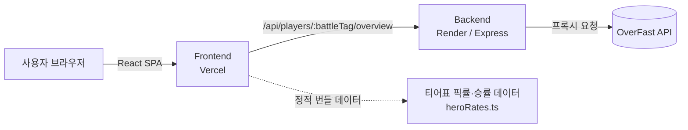

# WatchMeta


> 역할군별 **영웅 메타 티어표**와 내 **전적 분석**을 한 화면에서 제공하는 모바일 최적화 오버워치 웹 서비스

경쟁전에서 이기려면 지금 이 패치, 이 랭크, 이 서버에서 어떤 영웅이 강한지 아는 것이 가장 빠른 길입니다. WatchMeta는 이 질문에 답하는 것을 최우선 목표로 삼습니다 — 서버·랭크별 픽률·승률·밴률을 계산해 탱/딜/힐 역할군별 S\~D **메타 티어표**로 보여주고, 배틀태그 검색만으로 내 전적과 영웅별 세부 기록도 함께 확인할 수 있습니다.

**타겟 유저**: 오버워치를 즐겨 플레이하며 경쟁전 티어 상승에 관심이 많은 유저

---

## 주요 기능

### 🏆 메타 티어표 (핵심 기능)

역할군(탱/딜/힐)별로 영웅을 S\~D 티어로 분류해 보여주는 화면입니다. 서버(아시아/아메리카/유럽)와 랭크(브론즈\~그랜드마스터)를 바꾸면 해당 구간의 통계를 기준으로 티어가 다시 계산됩니다.

- **데이터 출처**: 블리자드 공식 [영웅 통계 페이지](https://overwatch.blizzard.com/ko-kr/rates/)에서 서버·랭크 조합별 픽률·승률·밴률을 수집해 [`heroRates.ts`](frontend/src/features/tier-list/data/heroRates.ts)에 정적으로 반영
- **티어 산정 로직** ([`tierList.ts`](frontend/src/features/tier-list/data/tierList.ts)): 영웅별 승률·픽률을 각각 0\~1로 정규화한 뒤 `메타 점수 = 승률 정규화값 × 0.5 + 픽률 정규화값 × 0.5`로 계산하고, 점수 순위를 `S 15% / A 25% / B 30% / C 20% / D 10%` 비율로 잘라 티어를 배정
- 패치 버전 선택 UI는 준비되어 있으나 아직 실데이터 연동 전 (다음 로드맵 항목)

### 🔍 전적 검색 & 프로필

배틀태그로 검색하면 백엔드가 [OverFast API](https://overfast-api.tekrop.fr)를 조회해 경쟁전 티어, 총 플레이타임, 승률, KDA, 모스트 영웅을 보여줍니다. 프로필에서 특정 영웅을 선택하면 그 영웅만의 승률·KDA·플레이타임 등 세부 기록으로 이동할 수 있습니다.

### 📜 패치 노트

블리자드 공식 패치 노트를 정리해 영웅 밸런스 변경 사항을 카드 형태로 보여줍니다.

### 🕘 최근 검색 기록

검색한 배틀태그를 브라우저 로컬(Zustand `persist`)에 저장해 재검색·삭제할 수 있습니다.

---

## 아키텍처



- **전적 검색·프로필**은 프론트엔드가 백엔드(Express)를 거쳐 OverFast API를 호출하는 실시간 프록시 구조입니다. 백엔드는 영웅 메타데이터를 메모리에 캐싱([`heroesCache.ts`](backend/src/services/heroesCache.ts))해 매 요청마다 반복 조회하지 않습니다.
- **메타 티어표**는 별도 API 호출 없이 프론트엔드에 번들된 정적 데이터를 클라이언트에서 그룹핑·정렬해 보여주는 구조입니다. 데이터 최신화는 [`heroRates.ts`](frontend/src/features/tier-list/data/heroRates.ts)를 갱신하는 방식으로 이뤄집니다.

---

## 기술 스택

| 영역 | 기술 |
| --- | --- |
| Frontend | React 19, TypeScript, Vite 8 |
| 스타일링 | Tailwind CSS v4 (`@tailwindcss/vite`) |
| 라우팅 | React Router v7 |
| 서버 상태 | TanStack Query |
| 클라이언트 상태 | Zustand (`persist` 미들웨어) |
| HTTP 클라이언트 | Axios |
| 아이콘 | lucide-react |
| Backend | Express 5, TypeScript |
| 외부 데이터 | [OverFast API](https://overfast-api.tekrop.fr) (전적), 블리자드 공식 영웅 통계 페이지 (티어표) |
| 배포 | Vercel (Frontend), Render (Backend) |

---

## 프로젝트 구조

npm workspaces 기반 모노레포입니다. `frontend`는 화면과 상태 관리, `backend`는 OverFast API 프록시 역할만 담당하는 얇은 API 서버입니다.

```
WatchMeta/
├── frontend/
│   └── src/
│       ├── app/                    # 라우터(App Router), QueryClient 등 전역 Provider
│       ├── pages/                  # 라우트 단위 화면 (Home, Search, Profile, TierList, PatchNotes ...)
│       ├── features/               # 도메인별 로직 — 화면이 아니라 기능 단위로 응집
│       │   ├── tier-list/          #   ├─ data/  정적 픽률·승률 데이터 + 티어 산정 로직
│       │   │                       #   ├─ api/   백엔드 연동용 (현재 미사용, 로드맵 항목)
│       │   │                       #   └─ components, hooks
│       │   ├── player-search/      #   배틀태그 검색, 최근 검색 기록
│       │   ├── player-profile/     #   프로필 조회 API 연동, 영웅별 상세 스탯 카드
│       │   └── patch-notes/        #   패치 노트 정적 데이터 + 카드 UI
│       ├── components/             # 여러 feature가 공유하는 레이아웃 · 피드백 컴포넌트
│       ├── store/                  # Zustand 스토어 (최근 검색 기록 등)
│       ├── lib/                    # apiClient(Axios 인스턴스) 등 공용 클라이언트
│       └── types/                  # feature 간 공유되는 타입 정의
└── backend/
    └── src/
        ├── routes/players.ts       # GET /:battleTag/overview — 프로필 조회 API
        ├── services/
        │   ├── overfastClient.ts   # OverFast API용 Axios 인스턴스, 배틀태그 ↔ player_id 변환
        │   └── heroesCache.ts      # 영웅 메타데이터 인메모리 캐시
        ├── app.ts                  # Express 앱 설정 (cors, 라우터 등록, /health)
        └── index.ts                # 서버 엔트리포인트
```

---

## API

백엔드는 아래 엔드포인트만 노출하는 최소한의 프록시 서버입니다.

| 메서드 | 경로 | 설명 |
| --- | --- | --- |
| `GET` | `/health` | 헬스체크 (Render 배포 시 사용) |
| `GET` | `/api/players/:battleTag/overview` | 배틀태그로 경쟁전 티어, 플레이타임, 승률, 영웅별 스탯 등 프로필 데이터 조회 |

---

## 시작하기

npm workspaces로 묶여 있어 루트에서 한 번만 설치하면 됩니다.

```bash
git clone https://github.com/kangjooy0ung/WatchMeta.git
cd WatchMeta
npm install
```

프론트엔드와 백엔드 각각 `.env.example`을 참고해 `.env`를 생성합니다.

```bash
cp frontend/.env.example frontend/.env   # VITE_API_BASE_URL=http://localhost:4000/api
cp backend/.env.example backend/.env     # PORT=4000, OVERFAST_BASE_URL=https://overfast-api.tekrop.fr
```

```bash
npm run dev           # 프론트엔드 개발 서버 (http://localhost:5173)
npm run dev:backend   # 백엔드 개발 서버 (http://localhost:4000)
```

| 명령어 (루트에서 실행) | 설명 |
| --- | --- |
| `npm run dev` | 프론트엔드 개발 서버 실행 |
| `npm run dev:backend` | 백엔드 개발 서버 실행 |
| `npm run build` | 프론트엔드 타입체크 후 프로덕션 빌드 |
| `npm run build:backend` | 백엔드 프로덕션 빌드 |
| `npm run start:backend` | 빌드된 백엔드 실행 |
| `npm run lint` | 프론트엔드 oxlint 린트 검사 |

특정 워크스페이스에서 직접 명령을 실행하고 싶다면 `frontend/`, `backend/` 디렉터리로 이동해 각 `package.json`의 스크립트를 그대로 사용해도 됩니다.

---

## 배포

- **Frontend**: Vercel. 모노레포 구조이므로 프로젝트 설정에서 **Root Directory를 `frontend`로 지정**해야 합니다. npm workspaces로 `package-lock.json`이 루트 하나로 통합되어 있어, Vercel이 Root Directory 바깥의 lockfile을 읽도록 **"Include files outside of the root directory"** 옵션을 켜는 것이 안전합니다.
- **Backend**: Render (`render.yaml` 참고). `OVERFAST_BASE_URL` 환경 변수를 사용하며 `/health`로 헬스체크합니다.

---

## 로드맵 (6주 계획)

| 주차 | 목표 | 상태 |
| --- | --- | --- |
| 3주 | 오버워치 API 리서치 및 화면 흐름 기획 | ✅ 완료 |
| 4주 | 전적 검색 및 프로필 화면 구현, 실 데이터 연동 | ✅ 완료 |
| 5주 | 메타 티어표 실데이터 반영, 서버·랭크 필터 연동, 패치 노트 정리 | 🟡 진행 중 (패치 버전 필터 연동 예정) |
| 6주 | QA 테스트 및 Vercel/Render를 통한 최종 MVP 배포 | ⚪️ 예정 |

---

## 수익 모델

기본 기능은 무료로 제공해 유저를 확보하고, 구글 애드센스와 같은 웹 배너 광고를 통해 유지보수 비용 및 수익을 창출합니다.
